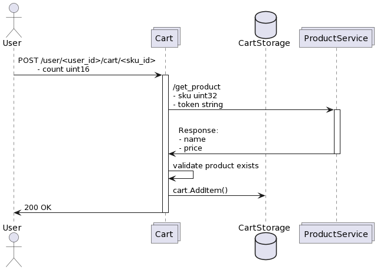
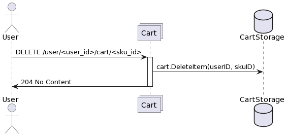
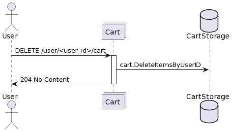
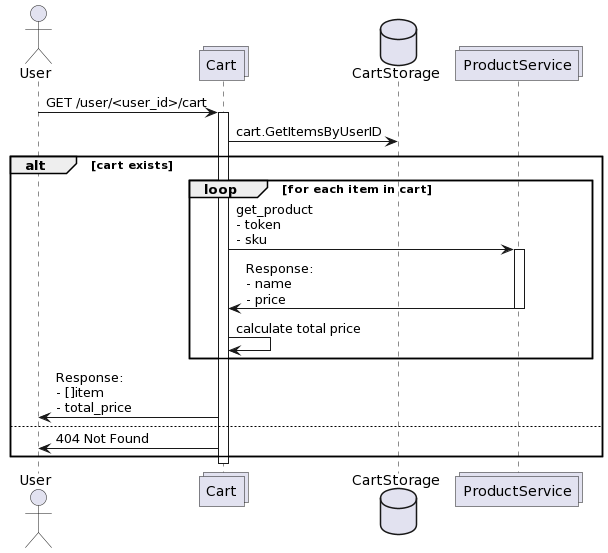

# Домашние задания по модулю "Основы Go"

Необходимо реализовать сервис для работы с корзиной пользователя Cart

## Основное задание
**Дедлайн**: 1 июня 23:59 (сдача)  
**Дедлайн для проверки**: 4 июня, 23:59 (проверка)

Необходимо имплементировать сервис, отвечающий за работу с корзиной пользователя (сервис Cart). Логика работы методов и их контракты описаны ниже.

Требования к решению:

1. Используем HTTP, на основе стандартной библиотеки Go 1.22
2. Для определения существования товара делаем поход во внешний сервис (Product Service)
3. Состояние храним в in-memory, персистентное хранилище на данный момент не требуется
4. Никакого резерва стоков не делаем, логика простейшая

## Дополнительное задание (на 10 баллов)

1. Делаем Middleware, который будет логировать поступающие запросы
2. Делаем валидацию входящих структур на основе любой open-source библиотеки (Можно подсмотреть тут - https://awesome-go.com/validation/)
3. Делаем ретраи в Product Service на 420/429 статус в виде Client Middleware. 3 ретрая, потом ошибка

## Спецификация

### Добавить товар в корзину

  Идентификатором товара является числовой идентификатор SKU. Метод добавляет указанный товар в корзину 
определенного пользователя. Каждый пользователь имеет числовой идентификатор userID. При добавлении в корзину 
проверяем, что товар существует в специальном сервисе.

Один и тот же товар может быть добавлен в корзину несколько раз, при этом количество экземпляров складывается.

| Метод | URI                                             |
|-------|-------------------------------------------------|
| POST  | /user/<user_id>/cart/<sku_id>                   |

**Параметры запроса:**

| Параметр | Тип параметра | Тип данных | Пример | Описание                                                        |
|----------|---------------|------------|--------|-----------------------------------------------------------------|
| user_id  | query path    | int64      | 1007   | Идентификатор пользователя в корзину которого добавляется товар |
| sku_id   | query path    | int64      | 2008   | Идентификатор товара, добавляемого в корзину                    |
| count    | body          | uint16     | 12     | Количество товаров, добавляемое в корзину                       |

**Параметры ответа:**

отсутствуют

**Диаграмма последовательности:**




### Удалить товар из корзины

  Метод полностью удаляет все количество товара из корзины пользователя. Если у пользователя вовсе нет данной позиции, 
то возвращается такой же ответ, как будто бы все позиции данного sku были успешно удалены 

| Метод  | URI                                             |
|--------|-------------------------------------------------|
| DELETE | /user/<user_id>/cart/<sku_id>                   |

**Параметры запроса:**

| Параметр | Тип параметра | Тип данных | Пример | Описание                                                        |
|----------|---------------|------------|--------|-----------------------------------------------------------------|
| user_id  | query path    | int64      | 1007   | Идентификатор пользователя в корзину которого добавляется товар |
| sku_id   | query path    | int64      | 2008   | Идентификатор товара, удаляемого из корзины                     |

**Параметры ответа:**

отсутствуют

**Диаграмма последовательности:**




### Очистить корзину пользователя

  Метод полностью очищает корзину пользователя. Если у пользователя нет корзины или она пуста, то как и при успешной
очистке корзины необходимо вернуть код ответа 204 No Content.

| Метод  | URI                  |
|--------|----------------------|
| DELETE | /user/<user_id>/cart |

**Параметры запроса:**

| Параметр | Тип параметра | Тип данных | Пример | Описание                                                        |
|----------|---------------|------------|--------|-----------------------------------------------------------------|
| user_id  | query path    | int64      | 1007   | Идентификатор пользователя в корзину которого добавляется товар |

**Параметры ответа:**

отсутствуют

**Диаграмма последовательности:**




### Получить содержимое корзины

  Метод возвращает содержимое корзины пользователя на текущий момент. Если корзины у переданного пользователя нет,
либо она пуста, следует вернуть 404 код ответа. Товары в корзине упорядочены в порядке возрастания sku.

| Метод | URI                       |
|-------|---------------------------|
| GET   | /user/<user_id>/cart/list |

**Параметры запроса:**

| Параметр | Тип параметра | Тип данных | Пример | Описание                                                        |
|----------|---------------|------------|--------|-----------------------------------------------------------------|
| user_id  | query path    | int64      | 1007   | Идентификатор пользователя в корзину которого добавляется товар |

**Параметры ответа:**

| Параметр        | Тип данных | Пример                                           | Описание                                     |
|-----------------|------------|--------------------------------------------------|----------------------------------------------|
| items[i].sku_id | int64      | 2008                                             | Идентификатор товара в корзине пользователя  |
| items[i].name   | string     | "Гречка пропаренная, в пакетиках для варки, 400" | Наименование товара                          |
| items[i].count  | uint16     | 10                                               | Количество единиц товара                     |
| items[i].price  | uint32     | 16                                               | Стоимость единицы товара в условных единицах |
| total_price     | uint32     | 160                                              | Суммарная стоимость всех товаров в корзине   |


**Пример ответа:**

```json
{
    "items" : [
        {
            "sku_id": 2958025,
            "name": "Roxy Music. Stranded. Remastered Edition",
            "count": 2,
            "price": 1028
        },
        {
            "sku_id": 773297411,
            "name": "Кроссовки Nike JORDAN",
            "count": 1,
            "price": 2202
        }
    ],
    "total_price": 4258
}
```

**Диаграмма последовательности:**




## Взаимодействие с Product service


Swagger развернут по адресу:
http://route256.pavl.uk:8080/docs/

## get_product

Request
```
{
    token string
    sku uint32
}
```

Response
```
{
    name string
    price uint32
}
```

## list_skus

Request
```
{
    token string
    startAfterSku uint32
    count uint32
}
```

Response
```
{
    skus []uint32
}
```

## Makefile

В рамках данного задания необходимо имплементировать следующие таргеты:

- run-all – запускает сервисы (на данный момент он будет 1)

## Ожидаемый результат

- с помощью команды `make run-all` можно запустить приложение
- приложение слушает http запросы на порту 8082
- реализованы АПИ методы
  - POST   /user/<user_id>/cart/<sku_id>
  - DELETE /user/<user_id>/cart/<sku_id>
  - DELETE /user/<user_id>/cart
  - GET    /user/<user_id>/cart
- методы реализуют заявленную бизнес логику
- методы валидируют запросы и отдают описанный в спецификации коды ошибок
- информация о пользователях и их состоянии корзины хранится в памяти приложения
- при рестарте приложения состояние системы теряется

## Сценарии тестирования с примерами запроса (для тьютора)

Сценарий тестирования следует описать в [cart.http](./cart.http)
