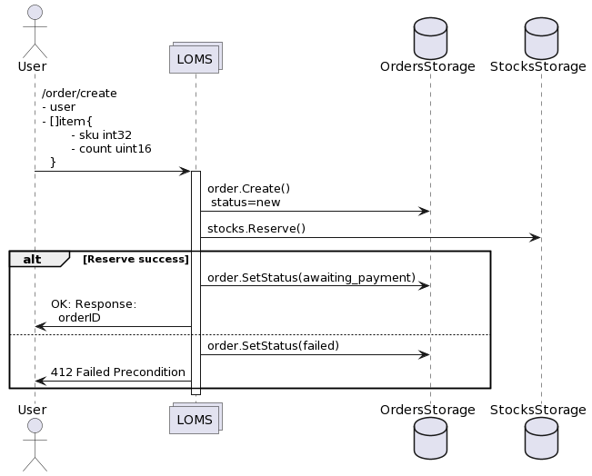
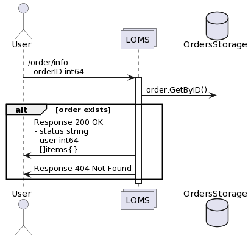
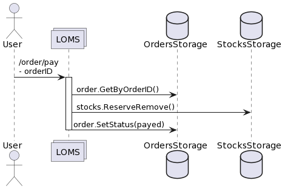
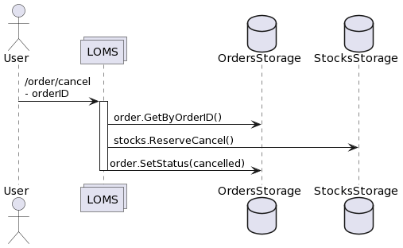
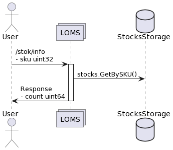
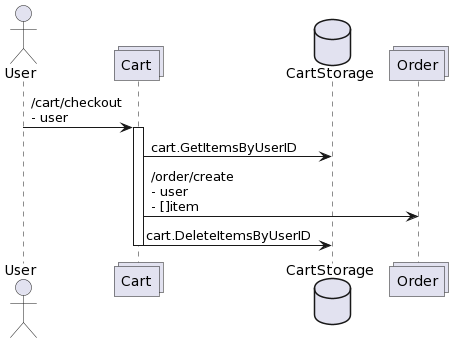
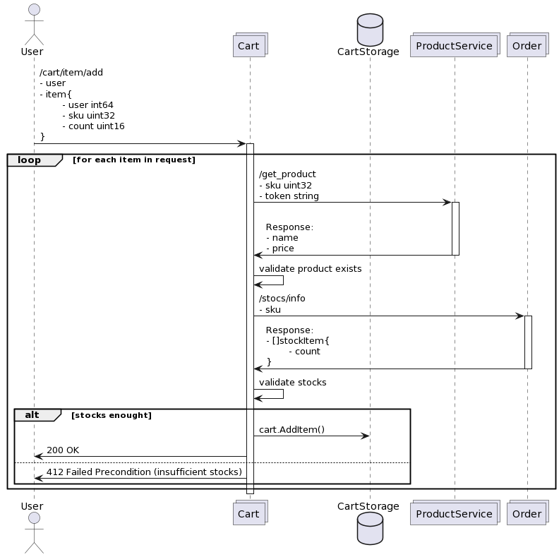

# Домашние задания по модулю "Межсервисное взаимодействие и основы эксплуатации"

Добавить сервис LOMS и организовать взаимодействие между cart и loms с использованием gRPC

## Основное задание

Необходимо:
- Имплементировать сервис, отвечающий за учет заказов и стоки по товарам. Логика работы методов и их контракты описаны ниже.
- Реализовать взаимодействие сервисов cart и loms через gRPC

Требование к решению:
- Создать protobuf контракт сервиса loms
- В каждом проекте нужно добавить в Makefile команды для генерации .go файлов из proto файлов и установки нужных зависимостей (используем protoc)
- Состояние храним в in-memory, персистентное хранилище на данный момент не требуется. 2 репозитория - Stock и Order
- Код должен быть покрыт тестами
- Тесты на методы репозитория - не делаем
- gRPC интерцептор
    - Валидация proto структур через proto-gen-validator
- Добавить HTTP-gateway


## Дополнительное задание
- Добавить swagger-ui и возможность совершать запросы из swagger к сервису
- Написать end-to-end тесты на все новые методы 


## Спецификация LOMS (Logistics and Order Management System)

Сервис отвечает за учет заказов и стоки по товарам. 


### OrderCreate

Создает новый заказ для пользователя из списка переданных товаров с резервированием нужного количества стоков
+ заказ получает статус "new"
+ резервирует нужное количество единиц товара
+ если удалось зарезервировать стоки, заказ получает статус "awaiting payment"
+ если не удалось зарезервировать стоки, заказ получает статус "failed"



Request
```
{
    user int64
    items []{
        sku uint32
        count uint16
    }
}
```

Response
```
{
    orderID int64
}
```

### OrderInfo

Показывает информацию по заказу



Request
```
{
    orderID int64
}
```

Response
```
{
    status string // (new | awaiting payment | failed | payed | cancelled)
    user int64
    items []{
        sku uint32
        count uint16
    }
}
```

### OrderPay

Помечает заказ оплаченным. Зарезервированные товары должны перейти в статус купленных.
+ удаляем зарезервированные стоки на товаре
+ заказ получает статус "payed"




Request
```
{
    orderID int64
}
```

Response
```
{}
```

### OrderCancel

Отменяет заказ, снимает резерв со всех товаров в заказе.
+ зарезервированные стоки на товаре становятся свободными стоками
+ заказ получает статус "cancelled"




Request
```
{
    orderID int64
}
```

Response
```
{}
```

### StocksInfo

Возвращает количество товаров, которые можно купить. Если товар был зарезервирован у кого-то в заказе и ждет оплаты, его купить нельзя.
- данные по товарам берутся из stock-data.json (embed)
  - структура stock:
    - sku - товар
    - total_count - всего товаров
    - reserverd - количество зарезервированных



Request
```
{
    sku uint32
}
```

Response
```
{
    count uint64
}
```

## Доработки сервиса cart

1) Требуется добавить метод checkout - оформить заказ по всем товарам корзины. Вызывает loms.OrderCreate.
Сервис cart имеет HTTP интерфейс. Взаимодействие с LOMS - через gRPC.
### cart/checkout




Request
```
{
    user int64
}
```

Response
```
{
    orderID int64
}
```

2) Добавляем запрос в loms.StocksInfo для валидации количества стоков
Взаимодействие через gRPC
### /user/<user_id>/cart/<sku_id>





    
# Путь покупки товаров:

- cart/item/add - добавляем в корзину и проверяем, что есть в наличии
- cart/item/delete - можем удалять из корзины
- cart/list - можем получать список товаров корзины
- cart/checkout - приобретаем товары через Checkout
- order/pay - оплачиваем заказ
- order/cancel - отмена заказа до оплаты

### Дедлайны сдачи и проверки задания: 
- 15 июня 23:59 (сдача) / 18 июня, 23:59 (проверка)
